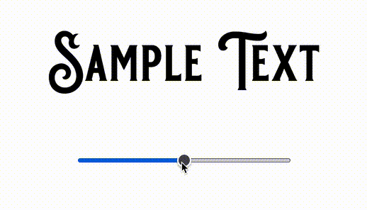

# svg text wrap/arch project

I used the 'transform' function of `warpjs`.

So the thought process behind this is, when the slider value is decreasing, I need to arch downwards, and arch upwards while slider
value is increasing.

While increasing or decreasing the slider, I calculated the difference between the last and current value of the slider, because the transformation function should be dependent on this to calculate the increasing/decreasing points on the Y axis or the positive or negative Y radius, this I am calling as 'delta' but this later acts as the radius.

The archUpwards and archDownwards functions takes the warp instances which has the SVG and also takes in the radius.
Used this radius and multiplied with a our amplitude, a constant of 10 in my case (it can be less or more, if less the arch will be lesser if more arch will be more) and multiplied the entire thing with our Math.sin(...) function, which can be seen in getSinCurve.

Used the formula: y = r sinA which is for one half of the sin curve.

For the sin curve taken the perodicity / frequecy / peak to peak distance of 120 from the standard angles 30, 60, 90, 120 and in our case 120 fits fine.

Using the above concepts and using the warpjs's transform function manipulated Y axis through archUpwards and archDownwards functions to give the text wrapping effect.

# React + TypeScript + Vite

do `npm install` to install dependencies

do `npm run dev` to run the app
